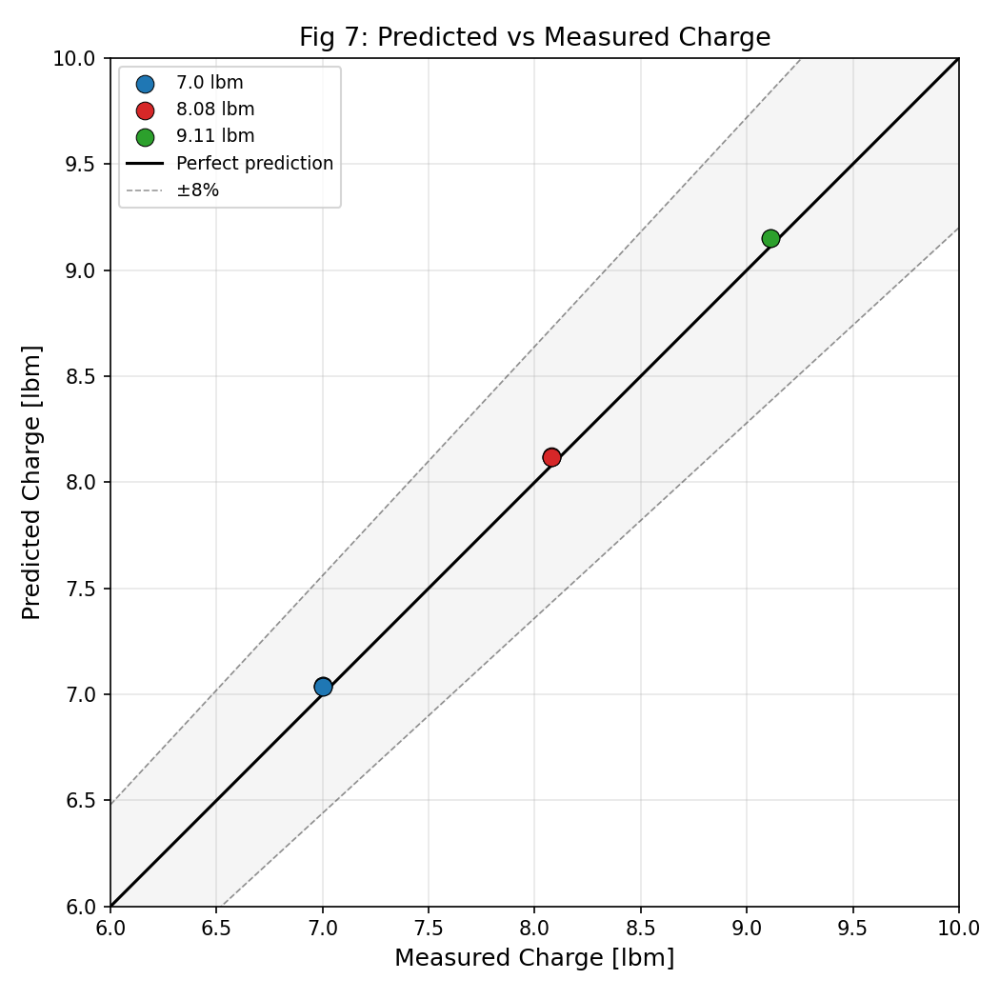
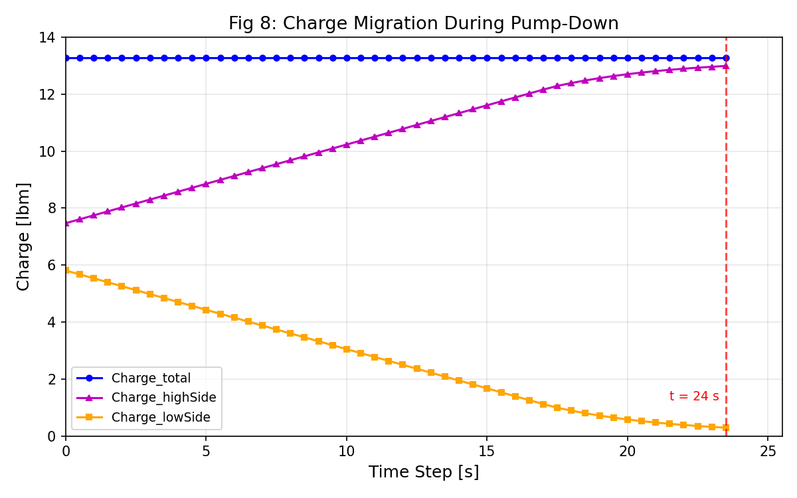
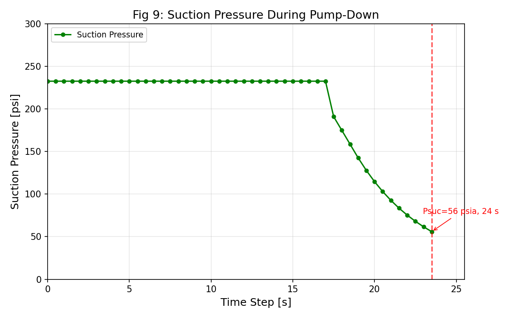
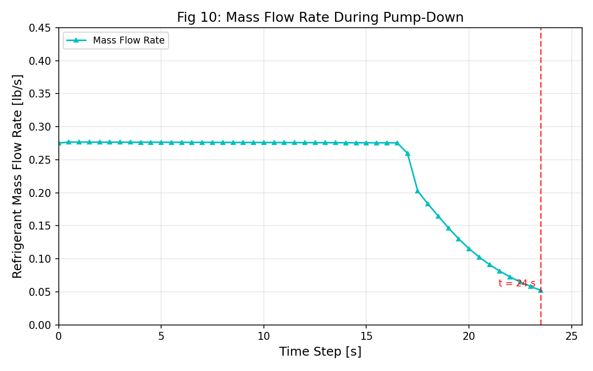

# Pump-Down Charge Prediction Reproduction

Python reproduction of the refrigerant charge prediction method from:

> B. Li, B. Shen, D. Welch, and K. Gluesenkamp, "A Refrigerant Charge Prediction Method Based on Pump Down Operation," *International Journal of Refrigeration*, vol. 164, pp. 197–207, 2024. [doi:10.1016/j.ijrefrig.2024.05.001](https://doi.org/10.1016/j.ijrefrig.2024.05.001)

## Quick Start

```bash
cd pumpdown
python -m venv .venv && .venv/bin/pip install -r ../requirements.txt
.venv/bin/python reproduce_all.py
```

Output goes to `pumpdown/figures/reproduced/`.

## Results

### Fig 7 — Predicted vs Measured Charge (3-ton split system, 10 validation cases)

Mean absolute error: **0.5%** (paper target: <6%). All 10/10 cases within 6%.



### Fig 8 — Charge Migration During Pump-Down (5-ton system)

Total charge constant at 13.28 lbm. Low-side depletes from 5.81 to 0.29 lbm over 24 s.



### Fig 9 — Suction Pressure During Pump-Down (5-ton system)

Characteristic plateau at ~233 psia (phase 1) followed by sharp drop to cutoff at 56 psia.



### Fig 10 — Mass Flow Rate During Pump-Down (5-ton system)

Initial 0.28 lbm/s (paper: ~0.40), decreasing to 0.05 lbm/s at termination.



See [REPRODUCTION_REPORT.md](REPRODUCTION_REPORT.md) for detailed comparison tables.

## Project Structure

```
├── reproduce_paper.py          # 3-ton charge prediction (10 validation cases)
├── debug_case10.py             # Diagnostic for individual test cases
├── REPRODUCTION_REPORT.md      # Current reproduction status
├── DEVIATIONS.md               # Known deviations from paper
│
├── pyhpdm/                     # Core physics library
│   ├── properties/             #   CoolProp wrapper (R410A)
│   ├── components/             #   Compressor, valve, heat exchangers
│   ├── charge/                 #   Pump-down simulator, charge inventory
│   └── solver/                 #   Charge-balance root-finding solver
│
├── pumpdown/                   # Figure reproduction & 5-ton simulation
│   ├── reproduce_all.py        #   ** Main entry point: generates all figures **
│   ├── src/                    #   Plotting and unit conversions
│   └── figures/reproduced/     #   Output figures
│
└── references/                 # Scraped HPDM data, audit docs
    ├── hpdm_scraped/           #   Compressor maps, HX geometry from HPDM web
    ├── paper_audit.md          #   Equation-by-equation audit of paper
    └── math_to_code.md         #   Paper notation -> code mapping
```

## Key Physics

- **Compressor**: AHRI 10-coefficient polynomial map (Eq. 4)
- **Condenser**: Segment-by-segment microchannel model with Rouhani-Axelsson void fraction
- **Valve leakage**: 4-way valve Cv model (Eq. 5-6)
- **Charge balance**: Root-finding solver varies T_cond until inventory = target
- **Pump-down**: Two-phase LP reservoir model (phase 1: liquid boil-off, phase 2: vapor evacuation)

## Known Limitations

- Initial mass flow rate for 5-ton system is ~0.28 lbm/s vs paper's ~0.40 lbm/s
  (the simple two-phase model doesn't capture the gradual flow decrease seen in reality)
- Initial suction pressure is 233 psia vs paper's ~250 psia (CoolProp vs REFPROP difference)
- See [DEVIATIONS.md](DEVIATIONS.md) for full list

## References

1. B. Li, B. Shen, D. Welch, and K. Gluesenkamp, "A Refrigerant Charge Prediction Method Based on Pump Down Operation," *International Journal of Refrigeration*, vol. 164, pp. 197–207, 2024.
2. ORNL/CON-343: Fischer, S.K. and Rice, C.K., "The Oak Ridge Heat Pump Design Model: Mark IV," Oak Ridge National Laboratory, 1991.
3. [CoolProp](http://www.coolprop.org/) — Open-source thermophysical property library (used in place of REFPROP).
